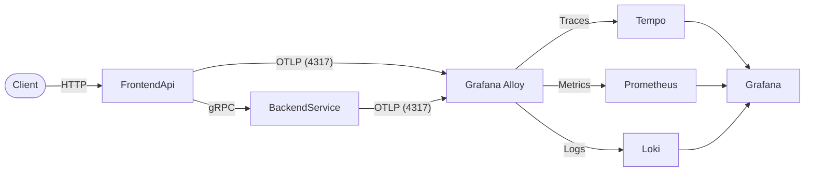

# .NET Observability Demo

Two ASP.NET Core 10 applications with full observability via the Grafana LGTM stack (Loki, Grafana, Tempo, Prometheus) using Grafana Alloy as the OpenTelemetry Collector.

## Architecture



## Applications

| App | Role | Technology |
|-----|------|-----------|
| **FrontendApi** | Front-tier HTTP API | ASP.NET Core 10 Minimal API |
| **BackendService** | Middle-tier service | ASP.NET Core 10 gRPC |

### API Endpoints (FrontendApi)

- `GET /api/orders/{id}` — Fetch an order by ID
- `POST /api/orders` — Place a new order (body: `{"item": "...", "quantity": N}`)

## Quick Start

### Prerequisites

- Docker & Docker Compose

### Run

```bash
docker compose up -d
```

Wait for all containers to start (~30 seconds for first build).

### Test

```bash
# Get an order
curl http://localhost:5000/api/orders/1

# Place an order
curl -X POST http://localhost:5000/api/orders \
  -H "Content-Type: application/json" \
  -d '{"item": "Widget", "quantity": 3}'
```

### Stop

```bash
docker compose down
```

To also remove volumes:

```bash
docker compose down -v
```

## Services & Ports

| Service | Port | URL | Purpose |
|---------|------|-----|---------|
| FrontendApi | 5000 | http://localhost:5000 | HTTP API |
| Grafana | 3000 | http://localhost:3000 | Dashboards & Explore |
| Prometheus | 9090 | http://localhost:9090 | Metrics |
| Tempo | 3200 | http://localhost:3200 | Traces |
| Loki | 3100 | http://localhost:3100 | Logs |
| Grafana Alloy | 12345 | http://localhost:12345 | Alloy UI / Pipeline Debug |

## Verifying Observability

### 1. Traces (Tempo)

1. Open Grafana → **Explore** → Select **Tempo** datasource
2. Search by service name: `FrontendApi` or `BackendService`
3. You'll see distributed traces showing: `HTTP request → gRPC client → gRPC server`

### 2. Metrics (Prometheus)

1. Open Grafana → **Explore** → Select **Prometheus** datasource
2. Try queries:
   - `http_server_request_duration_seconds_bucket` — Request latency histogram
   - `http_server_active_requests` — Active requests gauge
   - `rpc_server_duration_bucket` — gRPC server latency

### 3. Logs (Loki)

1. Open Grafana → **Explore** → Select **Loki** datasource
2. Try queries:
   - `{service_name="FrontendApi"}` — All FrontendApi logs
   - `{service_name="BackendService"}` — All BackendService logs
3. Click on a log line with a TraceID to jump to the trace in Tempo

## Project Structure

```
dotnet-observability/
├── src/
│   ├── Shared/Protos/           # Shared gRPC proto library
│   │   ├── Protos.csproj
│   │   └── backend.proto
│   ├── FrontendApi/             # App A — HTTP API (gRPC client)
│   │   ├── FrontendApi.csproj
│   │   ├── Program.cs
│   │   └── Dockerfile
│   └── BackendService/          # App B — gRPC Server
│       ├── BackendService.csproj
│       ├── Program.cs
│       ├── Services/OrderService.cs
│       └── Dockerfile
├── config/
│   ├── alloy/config.alloy       # Grafana Alloy (OTel Collector)
│   ├── tempo/tempo.yaml         # Tempo trace storage
│   ├── loki/loki.yaml           # Loki log storage
│   ├── prometheus/prometheus.yml # Prometheus metrics
│   └── grafana/provisioning/    # Grafana auto-provisioned datasources
├── docker-compose.yml
└── README.md
```

## Telemetry Flow

1. Both .NET apps emit **traces**, **metrics**, and **logs** via OTLP gRPC to **Grafana Alloy** (port 4317)
2. Alloy batches and routes:
   - **Traces** → Tempo (OTLP gRPC)
   - **Metrics** → Prometheus (remote write)
   - **Logs** → Loki (OTLP HTTP)
3. **Grafana** queries all three backends with cross-linked datasources (trace → logs, trace → metrics)

## Troubleshooting

| Issue | Solution |
|-------|----------|
| Containers won't start | Run `docker compose logs <service>` to check errors |
| No traces in Tempo | Check Alloy logs: `docker compose logs alloy` |
| No metrics in Prometheus | Verify Prometheus targets: http://localhost:9090/targets |
| gRPC connection refused | Ensure `backend-service` is healthy: `docker compose ps` |
| Build fails | Run `dotnet build` locally to check for compilation errors |

## Tech Stack

- **.NET 10** — ASP.NET Core Minimal API + gRPC
- **OpenTelemetry** — Traces, Metrics, Logs instrumentation
- **Grafana Alloy** — OpenTelemetry Collector (receives, processes, exports telemetry)
- **Grafana Tempo** — Distributed tracing backend
- **Prometheus** — Metrics storage & query
- **Grafana Loki** — Log aggregation
- **Grafana** — Visualization & exploration
